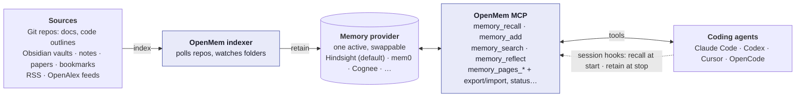
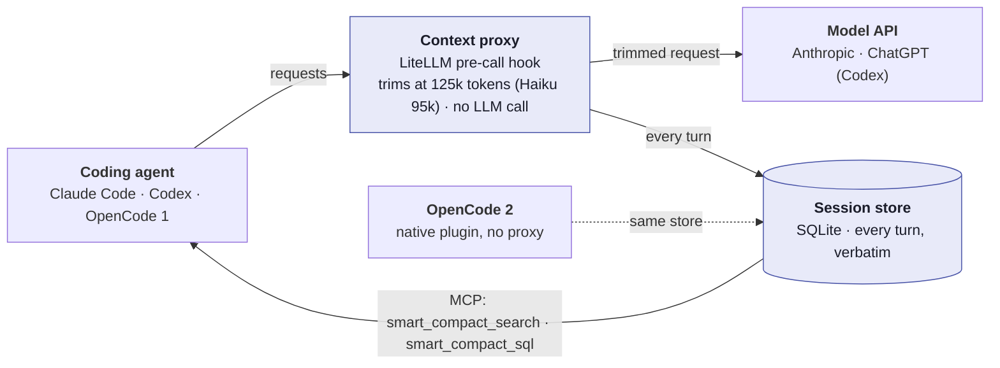

# OpenMem

> [!CAUTION]
> **Context management is leaving OpenMem.** Smart compaction, the LiteLLM context proxy, and the OpenCode trim plugin in this repo are **deprecated** here and moving to **[Smarter Compact](https://github.com/bcmyguest/smarter-compact)** ([docs](https://bcmyguest.github.io/smarter-compact/), `npm install -g smarter-compact`). Use OpenMem for **memory** (providers, indexer, `memory_*` MCP). Existing OpenMem stacks can still enable the compose `context-proxy` profile; new context work belongs in Smarter Compact.

**OpenMem.** Pluggable [memory providers](https://bcmyguest.github.io/openmem/docs/provider-status/) (Hindsight, mem0, Cognee) and one setup wizard for coding-agent memory — retain, recall, and index your sources.

**A. Memory**: your sources become memory any agent can query.

<picture>
<source media="(prefers-color-scheme: dark)" srcset="https://bcmyguest.github.io/openmem/media/overview-memory-wide-dark.png" />

</picture>

**B. Context management** *(deprecated in OpenMem — use [Smarter Compact](https://github.com/bcmyguest/smarter-compact) instead)*: long sessions stay under the limit; nothing is summarized away.

<picture>
<source media="(prefers-color-scheme: dark)" srcset="https://bcmyguest.github.io/openmem/media/overview-context-wide-dark.png" />

</picture>

**Benchmarks (context — deprecated here):** In seed-matched [ContextBench](https://github.com/RulinShao/ContextBench) log tasks on Haiku 5.5, smart compaction scored 0.469 higher than keep-everything (95% bootstrap interval 0.339–0.578; eight pairs). Methods and charts still live in this repo ([redirect](docs/context-management.md) · [evidence plan](docs/evidence-plan.md#completed-seed-paired-comparisons)); ongoing product docs and install are on [Smarter Compact](https://bcmyguest.github.io/smarter-compact/context-management.html).

<picture>
<source media="(prefers-color-scheme: dark)" srcset="https://bcmyguest.github.io/openmem/media/contextbench-quality-log-dark.png" />

</picture>

**Docs:** [bcmyguest.github.io/openmem/](https://bcmyguest.github.io/openmem/)

**MCP:** `npx -y -p @bcmyguest/openmem openmem-mcp` (after the wizard — it needs a running provider)

**Start here:** [Concepts](https://bcmyguest.github.io/openmem/docs/concepts/) · [Quickstart](https://bcmyguest.github.io/openmem/docs/getting-started/) · [Compatibility](https://bcmyguest.github.io/openmem/docs/compatibility/) · [Development](docs/development.md) (clone, tests, prek)

## Quickstart

| Step | Command |
| --- | --- |
| 1. Wizard | `npx @bcmyguest/openmem setup` |
| 2. Check | `npx @bcmyguest/openmem doctor` |
| 3. Coding agents | `npx @bcmyguest/openmem install-coding-agent --yes` |

**From a git clone:** [Development guide](docs/development.md) (`npm install`, `npm run setup`, tests, prek).

**Needs (wizard):** Docker Compose v2, Node ≥ 24, and an LLM route for Hindsight — see [Quickstart](https://bcmyguest.github.io/openmem/docs/getting-started/).

Later: `npx @bcmyguest/openmem up` / `down` / `switch <provider> --yes` / `doctor`.

Wizard dry-run (what first setup plans — no writes):

Full guide: [Quickstart](https://bcmyguest.github.io/openmem/docs/getting-started/) · [Concepts](https://bcmyguest.github.io/openmem/docs/concepts/) · [Architecture](https://bcmyguest.github.io/openmem/docs/architecture/)

## Architecture

The two diagrams at the top show memory (A) and context management (B; **deprecated in OpenMem**, see [Smarter Compact](https://github.com/bcmyguest/smarter-compact)).

Same diagrams as Mermaid

```mermaid
flowchart LR
  S["<b>Sources</b><br/>Git repos: docs, code outlines<br/>Obsidian vaults · notes · papers · bookmarks<br/>RSS · OpenAlex feeds"] -->|index| I["<b>OpenMem indexer</b><br/>polls repos, watches folders"]
  I -->|retain| P[("<b>Memory provider</b><br/>one active, swappable<br/>Hindsight (default) · mem0 · Cognee · …")]
  P <--> M["<b>OpenMem MCP</b><br/>memory_recall · memory_add<br/>memory_search · memory_reflect<br/>memory_pages_* + export/import, status…"]
  M <-->|tools| A["<b>Coding agents</b><br/>Claude Code · Codex · Cursor · OpenCode"]
  A -.->|"session hooks: recall at start · retain at stop"| M
  classDef om fill:#e8eaf9,stroke:#4651a6,color:#1b1d2a
  class I,M om
```

```mermaid
flowchart LR
  A["<b>Coding agent</b><br/>Claude Code · Codex · OpenCode 1"] -->|requests| X["<b>Context proxy</b><br/>LiteLLM pre-call hook<br/>trims at 125k tokens (Haiku 95k) · no LLM call"]
  X -->|trimmed request| API["<b>Model API</b><br/>Anthropic · ChatGPT (Codex)"]
  X -->|every turn| S[("<b>Session store</b><br/>SQLite · every turn, verbatim")]
  S -->|"MCP: smart_compact_search · smart_compact_sql"| A
  O["<b>OpenCode 2</b><br/>native plugin, no proxy"] -.->|same store| S
  classDef om fill:#e8eaf9,stroke:#4651a6,color:#1b1d2a
  class X,S om
```

Native compaction replaces history with an LLM summary, so exact values can be lost; smart compaction keeps every turn verbatim and searchable. **Context trimming in OpenMem is deprecated** — use [Smarter Compact](https://github.com/bcmyguest/smarter-compact) (`smarter-compact enable`). Legacy stack path: [context proxy redirect](docs/context-proxy.md). See [architecture](https://bcmyguest.github.io/openmem/docs/architecture/) for memory runtime paths and provider-specific behavior.

## Providers and portability

- **Providers** — [Provider status](https://bcmyguest.github.io/openmem/docs/provider-status/) lists every provider and its support level from the manifests. Contributor details: [adding a provider](https://github.com/bcmyguest/openmem/blob/main/docs/memory-providers.md).
- **MCP** — unified `memory_*` plus optional native/NotebookLM servers: [MCP setup](https://bcmyguest.github.io/openmem/docs/mcp-setup/).
- **Context management (deprecated in OpenMem)** — moved to [Smarter Compact](https://github.com/bcmyguest/smarter-compact); OpenMem page is a [redirect](https://bcmyguest.github.io/openmem/docs/context-management/).
- **Portable memory** — `memory_export` / `memory_import` speak **PMM**: [Portable memory](https://bcmyguest.github.io/openmem/docs/memory-portability/).
- **Switch** — `npx @bcmyguest/openmem switch <provider>` does not migrate data by itself; export/import (or re-index) moves content.

Compose runs the shared `indexer` and the services required by the selected provider. Hindsight uses `litellm` and `hindsight` (`127.0.0.1:8888`); mem0 and Cognee use their own APIs and do not include LiteLLM by default. LiteLLM can also be added for `memory_reflect` synthesis on mem0/Cognee, or to host the optional context proxy's pre-call hook. See [Architecture](https://bcmyguest.github.io/openmem/docs/architecture/) for runtime paths.

## Inspiration and related

OpenMem is not affiliated with these projects; they shape the problem or the pattern.

| | |
| --- | --- |
| **[OpenFeature](https://openfeature.dev/)** | Inspiration for a vendor-agnostic interface + pluggable providers (there: feature flags; here: coding-agent memory). |
| **[mise](https://mise.jdx.dev/) / [asdf](https://asdf-vm.com/)** | One CLI over many backends; declarative config and tasks without replacing each tool’s own settings. |
| **[LiteLLM](https://github.com/BerriAI/litellm)** | Model proxy used on Hindsight stacks; its pre-call hook hosts the context proxy. |
| **[Hindsight coding agents](https://www.npmjs.com/package/@vectorize-io/hindsight-coding-agents)** | Reference implementation for knowledge pages, initiative capture and ingest status; OpenMem's hooks replace it in `openmem` mode. |
| **[Mainplane](https://github.com/mainplane-ai/mainplane)** | Inspiration for smart compaction: continue in a fresh context with a pointer to the saved transcript and retrieve as you go, instead of an LLM summary. |
| **[Letta](https://www.letta.com/) / [MemGPT](https://arxiv.org/abs/2310.08560)** | Inspiration for smart compaction: evicted turns kept verbatim in searchable recall storage the agent pages back with tools, and [file-style search over the transcript](https://www.letta.com/blog/benchmarking-ai-agent-memory/) (74.0% on LoCoMo). OpenMem does this in a proxy and an MCP server, so no Letta server is needed. |
| **[rtk](https://github.com/rtk-ai/rtk)** | Compresses shell command output before the agent sees it; `install-coding-agent` runs `rtk init` when it is installed. Inspired the context proxy's compression of large tool results (reimplemented, not bundled). |
| **[opencode-clm](https://github.com/bcmyguest/opencode-clm)** | OpenCode plugin for [Context Language Models](https://arxiv.org/abs/2609.37725): the model edits a file mirror of its own context. Same goal as smart compaction, with the model doing the trimming ([comparison](https://bcmyguest.github.io/openmem/docs/context-research/)). |
| **[Meridian](https://github.com/rynfar/meridian)** | Bridges a Claude subscription to an Anthropic-compatible API; optional Hindsight model backend ([guide](https://bcmyguest.github.io/openmem/docs/model-configuration/)). |
| **[OpenCode](https://opencode.ai/)** / **[Claude Code hooks](https://code.claude.com/docs/en/hooks)** / **[Codex hooks](https://developers.openai.com/codex/hooks)** | The agent hook and plugin APIs OpenMem translates between ([compatibility](https://bcmyguest.github.io/openmem/docs/compatibility/)). |

Research notes and benchmark results for the context proxy: [Context research](https://bcmyguest.github.io/openmem/docs/context-research/).

More setup analogues: [Pluggable memory providers](https://github.com/bcmyguest/openmem/blob/main/docs/memory-providers.md).

> Formerly **personal-memory**. Use the `openmem` CLI and MCP server name; installers drop the old `personal-memory` MCP entry.

## References

Papers and preprints cited in our context-management work ([full list](docs/references.md)):

| Reference | Link |
| --- | --- |
| MemGPT (Packer et al., 2023) | [arXiv:2310.08560](https://arxiv.org/abs/2310.08560) |
| LoCoMo (An et al., 2024) | [arXiv:2402.17753](https://arxiv.org/abs/2402.17753) |
| LongMemEval (Wu et al., 2024) | [arXiv:2410.10813](https://arxiv.org/abs/2410.10813) |
| MemoryAgentBench (2025) | [arXiv:2507.05257](https://arxiv.org/abs/2507.05257) |
| The Complexity Trap (Lindenbauer et al., 2025) | [arXiv:2508.21433](https://arxiv.org/abs/2508.21433) |
| Context Language Models / ContextBench (Shao et al., 2025) | [arXiv:2609.37725](https://arxiv.org/abs/2609.37725) |
| Compact-Bench (2026) | [arXiv:2610.31710](https://arxiv.org/abs/2610.31710) |

Reports and blogs (Context Rot, Letta LoCoMo, Anthropic context engineering): [references.md](docs/references.md#related-reports-and-benchmarks-not-arxiv).

## License

[Apache License 2.0](LICENSE) — see `LICENSE` (Copyright 2026 B Guest).

## Contributing

Contributions are welcome. See [CONTRIBUTING.md](CONTRIBUTING.md) and the [development guide](docs/development.md) for tests and CI.
